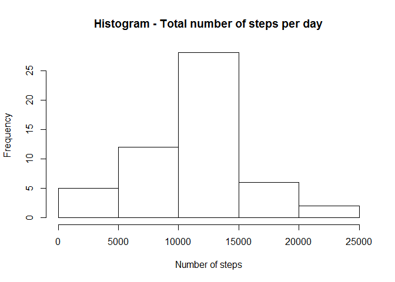
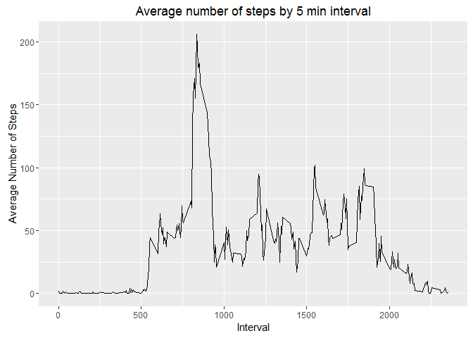
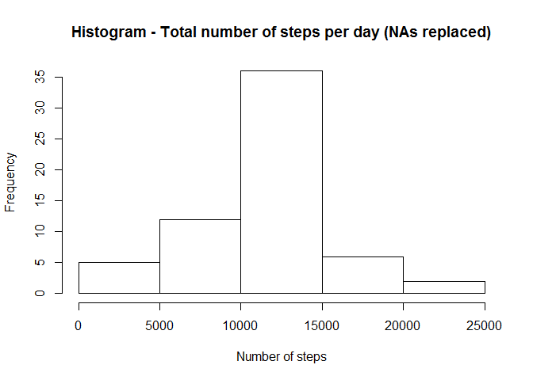
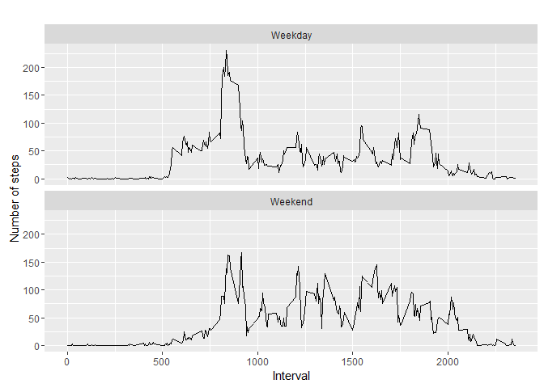

# Reproducible Research: Peer Assessment 1


## Loading and preprocessing the data

### Load the data (i.e. read.csv())


```r
library(dplyr)
```

```
## 
## Attaching package: 'dplyr'
```

```
## The following objects are masked from 'package:stats':
## 
##     filter, lag
```

```
## The following objects are masked from 'package:base':
## 
##     intersect, setdiff, setequal, union
```

```r
library(ggplot2)

Data <- read.csv("./Data/activity.csv", header = TRUE, sep = ",", na.strings = "NA")
```

## What is mean total number of steps taken per day?

1. Calculate the total number of steps taken per day


```r
Data_NA_Removed <- filter(Data, complete.cases(Data))
Group_by_day <- group_by(Data_NA_Removed, date)
Total_Steps_By_Day <- summarise(Group_by_day, total = sum(steps))
```

2. If you do not understand the difference between a histogram and a barplot, research the difference between them. Make a histogram of the total number of steps taken each day


```r
hist(Total_Steps_By_Day$total, main = "Histogram - Total number of steps per day", xlab = "Number of steps")
```

<!-- -->

3. Calculate and report the mean and median of the total number of steps taken per day


```r
meanByDay <- mean(Total_Steps_By_Day$total)
medianByDay <- median(Total_Steps_By_Day$total)
```

For the total number of steps taken per day, the mean is 1.0766189\times 10^{4} and the median is 10765

## What is the average daily activity pattern?

1. Make a time series plot (i.e. type = "l") of the 5-minute interval (x-axis) and the average number of steps taken, averaged across all days (y-axis)


```r
# First calculate the mean steps by interval
Data_Steps_By_Interval <- aggregate(steps ~ interval, Data_NA_Removed, mean)

qplot(
        x = interval, 
        y = steps, 
        data = Data_Steps_By_Interval, 
        geom = "line", 
        main = "Average number of steps by 5 min interval",
        xlab = "Interval",
        ylab = "Average Number of Steps"
    )
```

<!-- -->

2. Which 5-minute interval, on average across all the days in the dataset, contains the maximum number of steps?


```r
Data_Steps_By_Interval[which.max(Data_Steps_By_Interval$steps),]
```

```
##     interval    steps
## 104      835 206.1698
```

## Imputing missing values

1. Calculate and report the total number of missing values in the dataset (i.e. the total number of rows with NAs)


```r
sum(!complete.cases(Data))
```

```
## [1] 2304
```

2. Devise a strategy for filling in all of the missing values in the dataset. The strategy does not need to be sophisticated. For example, you could use the mean/median for that day, or the mean for that 5-minute interval, etc.


```r
# Combine the raw data frame Data with the data frame Data_Steps_By_Interval (above) having with mean number of steps per interval
Data_Filled_NAs <- merge(x = Data, y = Data_Steps_By_Interval, by = "interval")

# Modify the column names after the merge
names(Data_Filled_NAs) <- c("interval","steps","date","meanStepInterval")
```

3. Create a new dataset that is equal to the original dataset but with the missing data filled in.


```r
# Replace NAs with the mean number of steps per interval
Data_Filled_NAs <- transform(Data_Filled_NAs, steps = ifelse(is.na(steps), meanStepInterval, steps))
```

4. Make a histogram of the total number of steps taken each day and Calculate and report the mean and median total number of steps taken per day. Do these values differ from the estimates from the first part of the assignment? What is the impact of imputing missing data on the estimates of the total daily number of steps?


```r
Group_by_day2 <- group_by(Data_Filled_NAs, date)
Total_Steps_By_Day2 <- summarise(Group_by_day2, total = sum(steps))

hist(Total_Steps_By_Day2$total, main = "Histogram - Total number of steps per day (NAs replaced)", xlab = "Number of steps")
```

<!-- -->

```r
mean(Total_Steps_By_Day2$total)
```

```
## [1] 10766.19
```

```r
median(Total_Steps_By_Day2$total)
```

```
## [1] 10766.19
```

Outcome: Mean values remain the same but there is minimal difference in the median

## Are there differences in activity patterns between weekdays and weekends?

1. Create a new factor variable in the dataset with two levels - "weekday" and "weekend" indicating whether a given date is a weekday or weekend day.


```r
Data_Filled_NAs$WeekDay <- weekdays(as.Date(Data_Filled_NAs$date))
Data_Filled_NAs$isWeekDay <- ifelse( Data_Filled_NAs$WeekDay %in% c("Saturday","Sunday"), "Weekend", "Weekday")

# Remove 2 unneeded columns to keep data set clean
Data_Filled_NAs <- Data_Filled_NAs[ , -which(names(Data_Filled_NAs) %in% c("meanStepInterval","WeekDay"))]
```

2. Make a panel plot containing a time series plot (i.e. type = "l") of the 5-minute interval (x-axis) and the average number of steps taken, averaged across all weekday days or weekend days (y-axis). See the README file in the GitHub repository to see an example of what this plot should look like using simulated data.


```r
Data_Mean_Steps_By_Interval <- aggregate(steps ~ interval + isWeekDay, Data_Filled_NAs, mean)

qplot(
        data = Data_Mean_Steps_By_Interval, 
        x = interval, 
        y = steps, 
        # facets = ~isWeekDay,
        geom=c("line"),
        xlab = "Interval", 
        ylab = "Number of steps", 
        main = ""
    ) + facet_wrap(~ isWeekDay, ncol = 1)
```

<!-- -->

